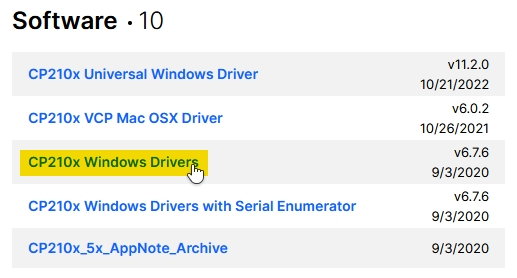
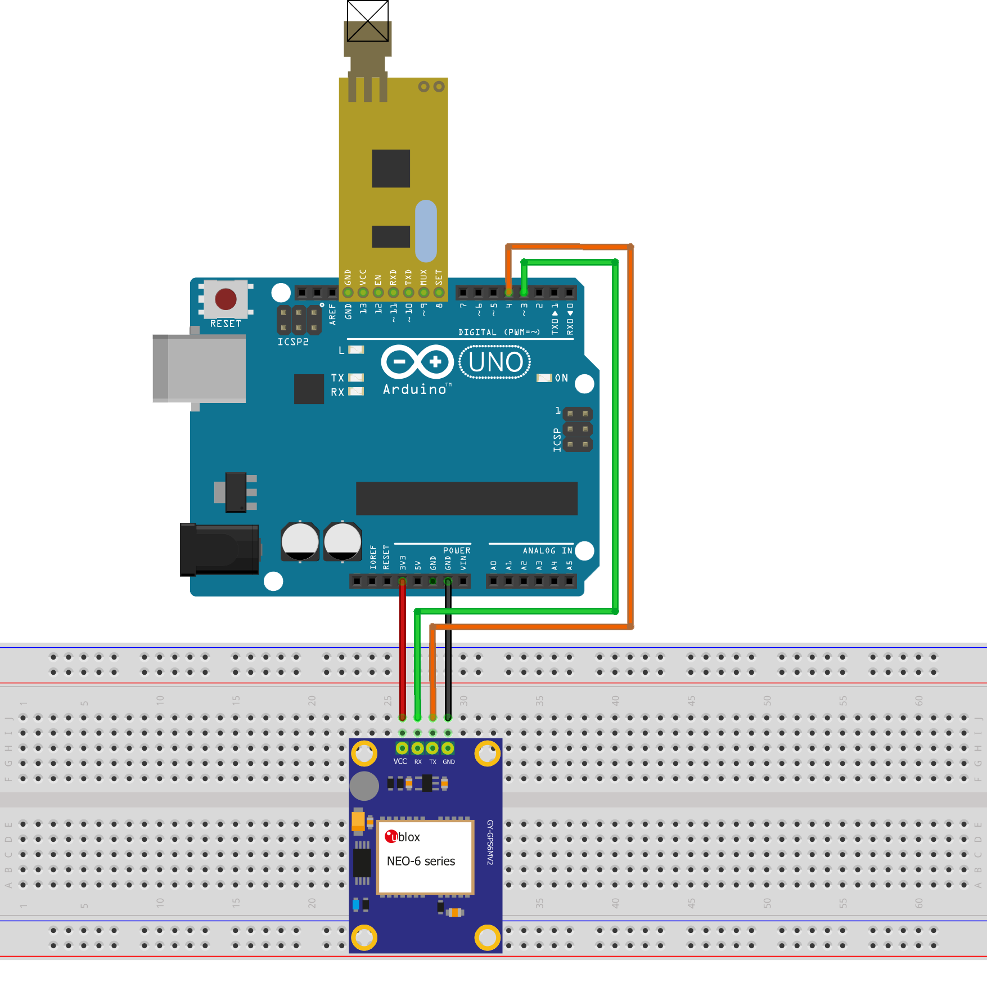
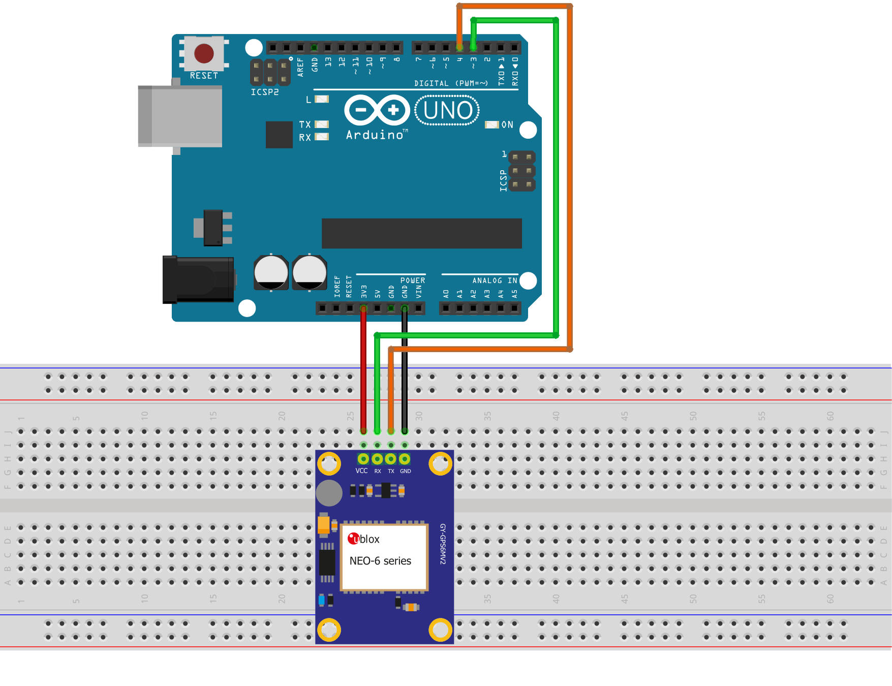

<h1 align="center">GPS</h1>
<h3 align="center">Easily view realtime NMEA data on Google Maps</h2>

<a href="https://www.arduino.cc/">

# Overview
GPS is a **Node.js** application based on **[GPS.js](https://github.com/infusion/GPS.js)** that allows you to view NMEA data coming from a GPS module on **Google Maps**. 

It is designed to be used with an **Arduino** microcontroller, but can be used with any device that can send NMEA data over a serial port.

# Features
- **Realtime** data visualization
- Keeps track of every **GPS fix** (until you reload the page)
- Runs on every platform that supports **Node.js**
- Open source
- Free
- It's easy to use

# Requirements
## Software
- **[Node.js](https://nodejs.org)** (v19.5.x)
- **[Git](https://git-scm.com/)** (optional)
- **[Arduino IDE](https://www.arduino.cc/en/software)**
- **Supported web browser** (Chrome, Firefox, Edge, Safari, etc.)

## Hardware
- **Arduino**
- **GPS module** (**[NEO-6M](https://amzn.eu/d/0F55El5)**)
- **Radio module** (**[APC220](https://www.dfrobot.com/product-57.html)**) (optional)
- **USB to UART Bridge** (**[CP210x](https://www.aliexpress.com/item/32505898388.html)**) (optional)
- **Breadboard**
- **Jumper wires**
- **USB cable**
- **Computer**

----

<strong>Open this section if you are using the radio module</strong>

## APC220 Setup
**Disconnect the APC220 from the Arduino before proceeding.**
1. Upload the **[apc220Cfg.ino](arduino/apc220Cfg/apc220Cfg.ino)** sketch to your Arduino
2. Disconnect the Arduino from your computer
3. Connect the APC220 to the Arduino to the GND, 13, 12, 11, 10, 9 and 8 pins 
4. Connect the Arduino to your computer
5. Open the **Serial Monitor**
6. Type `m` and press **Enter**
   - It should bring up a menu like this:

    

7. Follow the 'Write example' instruction and if you want, change the frequency
   - Save the frequency you chose (you will need it to configure the other APC220 module) 
8. Disconnect the Arduino from your computer
9.  Disconnect the APC220 from the Arduino and connect the other APC220 module to the Arduino
10.  Reconnect the Arduino to your computer
11.  Repeat steps 6 and 7

## Installing the CP210x Drivers
To receive data from the APC220 module, you can use another Arduino with the APC220 module connected to it or you can use an **UART to USB bridge**.
This project is designed to work with **CP210x**.

* Visit the **[Silicon Labs website](https://www.silabs.com/developers/usb-to-uart-bridge-vcp-drivers?tab=downloads)**
* If you are using **Windows**, download the driver with the name `CP210x Windows Drivers`

    

* Extract all the files from the ZIP file in a folder
* Run the `CP210xVCPInstaller_x64.exe` file and follow the instructions to install the driver

---

## Arduino Setup
**Disconnect everything from the Arduino before proceeding**

There are two versions of the Arduino sketch:
* One with the **APC220** module (**[radio_arduino.ino](arduino/radio_arduino/radio_arduino.ino)**)
* One without the **APC220** module (**[basic_arduino.ino](arduino/basic_arduino/basic_arduino.ino)**)

1. Upload one of the two sketches to your Arduino
2. Disconnect the Arduino from your computer

(<strong><em>APC220 Only</em></strong>)

* Connect the **GPS module** to the **Arduino** using the following pins:

    | GPS Module | -> | Arduino   |
    |------------|----|-----------|
    | VCC        | -> | 3.3V      |
    | GND        | -> | GND       |
    | RX         | -> | Digital 4 |
    | TX         | -> | Digital 3 |

* Connect the **APC220** module to the **Arduino** to the GND, 13, 12, 11, 10, 9 and 8 pins

3. Connect the Arduino to your computer

## Breadboard Circuit

<strong>With APC220</strong>

<strong>Without APC220</strong>

## Map Setup
1. Install the required software (Node.js)
2. Clone this repository by running `git clone https://github.com/CoccodrillooXDS/GPS` or download the repository as a ZIP file and extract it
3. Open Terminal or Command Prompt in the repository folder
4. Run `npm install` to install the dependencies
5. Run `node server` to start the application
6. Open a web browser and visit `http://localhost:3000`

## Contributing
You can contribute to the project by creating a pull request or an issue.

To contribute, you can fork the repository and after you made your changes, you can create a pull request.

## License
This project is licensed under the **MIT License**. See the **[LICENSE](LICENSE)** file for more information.